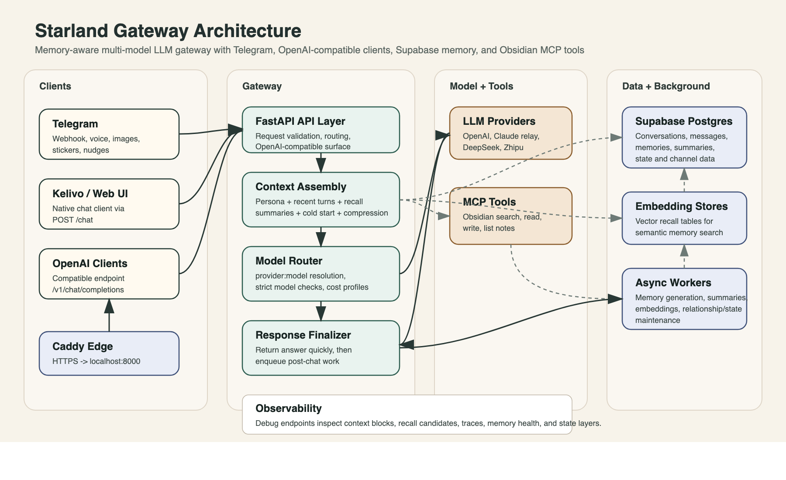

# Starland Gateway

A custom multi-provider LLM gateway built to support persona-aware conversation workflows, long-context management, and memory-oriented orchestration across different front ends.

## Overview

Starland Gateway is a custom multi-provider LLM gateway designed for persona-aware orchestration, long-context handling, and memory-oriented conversation workflows.

It sits between user-facing applications and model providers, adding a structured control layer for request preprocessing, routing, streaming, and memory-aware post-processing. Instead of treating each model call as an isolated API request, the gateway is designed to support continuity across interfaces, providers, and long-running conversations.

This public repository is a project showcase rather than the full production codebase. It documents the system’s architecture, design logic, and selected implementation patterns, while keeping private workflow logic, deployment-specific configuration, and sensitive memory infrastructure out of the public repo.

## Core Goals

- Route requests across multiple LLM providers through a unified interface
- Support persona/system prompt injection outside the frontend layer
- Manage long conversations through summarization and context budgeting
- Preserve recent conversational continuity while compressing older history
- Enable memory-aware workflows without exposing private user data
- Stream responses efficiently to the client layer

## Example Request Lifecycle

A typical request flows through the gateway in the following stages:

1. **Client request intake**  
   A frontend or client sends a chat request to the gateway through a unified API layer.

2. **Request preprocessing**  
   The gateway normalizes the request, injects system or persona instructions, and prepares the context window.

3. **Context handling**  
   Recent conversation turns are preserved, while older history can be compressed into summary layers to stay within budget.

4. **Model routing**  
   The request is routed to the selected provider and model through a multi-provider abstraction layer.

5. **Streaming response delivery**  
   The model response is streamed back to the client for a smoother interactive experience.

6. **Post-processing and memory hooks**  
   After response generation, the system can trigger logging, summary updates, or memory-oriented workflows asynchronously.

## Key Features

### 1. Multi-provider model routing
The gateway separates provider selection from application logic, making it possible to work with different model backends through a single service layer.

### 2. Persona-aware prompt orchestration
System-level instructions and persona logic can be injected centrally, rather than being tied to a single frontend.

### 3. Context budgeting and compression
To handle long conversations, the gateway applies context limits, keeps recent turns intact, and compresses older exchanges into summaries.

### 4. Layered summarization
The system is designed to support short-term, recent, and longer-horizon summary layers, helping preserve continuity without sending the entire conversation history upstream.

### 5. Streaming response support
The gateway supports streaming responses to improve responsiveness and create a smoother user experience.

### 6. Memory-oriented architecture
The broader design includes structured hooks for long-term memory workflows, summary storage, and retrieval-aware response generation.

## Why I Built It

Most chat interfaces treat model calls as isolated requests.  
That works for simple prompting, but it breaks down when the goal is continuity across long conversations, multiple providers, and persistent interaction styles.

I built Starland Gateway to explore a different approach: treating the model layer as part of a larger conversational system rather than a stateless API call.

This project reflects my interest in:
- LLM application architecture
- context management
- memory systems
- prompt orchestration
- practical infrastructure for human-centered AI interaction

## Architecture Diagram



## High-Level Architecture

```text
Frontend / Client
        ↓
   Starland Gateway
        ↓
 ┌───────────────────────┐
 │ Request preprocessing │
 │ - prompt injection    │
 │ - context budgeting   │
 │ - summary insertion   │
 └───────────────────────┘
        ↓
 ┌───────────────────────┐
 │ Model routing layer   │
 │ - provider selection  │
 │ - model normalization │
 └───────────────────────┘
        ↓
   LLM Provider APIs
        ↓
 ┌───────────────────────┐
 │ Post-processing layer │
 │ - streaming           │
 │ - logging             │
 │ - memory hooks        │
 └───────────────────────┘
        ↓
Frontend / Storage / Memory Services
```

## Public Scope of This Repository

This repository is intended to document the project’s design and engineering decisions.

It may include:
- architecture notes
- redacted code samples
- simplified interfaces
- request / response examples
- screenshots or diagrams
- design trade-offs and implementation notes

It does not include the full production implementation, private prompts, deployment secrets, user data, or private memory content.

## Example Design Areas

### Request Orchestration
The gateway prepares requests before they reach the model layer, including:
* **Model/Provider Selection:** Dynamically choosing the best engine for the task.
* **System Instructions:** Injecting persona-aware logic and safety guardrails.
* **Context Optimization:** Trimming or compressing history while preserving recent turns.
* **Layered Augmentation:** Attaching relevant summary layers where needed.

### Context Handling
One of the main design challenges is balancing **response quality, token cost, continuity, and latency**. The gateway addresses this by:
* **Message Retention:** Prioritizing the most recent interaction turns.
* **Summary-based Compression:** Using AI-generated summaries to retain long-term context without bloating token counts.

### Separation of Chat and Memory Workloads
The architecture supports the idea that not every task should run on the same model or with the same cost profile. For example:
* **Conversational Generation:** Optimized for speed and fluidity.
* **Memory Summarization:** Treated as a separate, background workload that can run on more cost-effective models.

---

## Technical Scope

The public version of the project reflects a system designed around:
- FastAPI-based request handling
- SSE-style streaming responses
- OpenAI-compatible client patterns
- multi-provider routing
- context budgeting and summary insertion
- separation of chat and memory-oriented workloads
- memory integration with external storage layers
- tool-oriented extensions through external knowledge interfaces
- portable orchestration across different frontends
  
---

## Why the Full Code Is Not Public

The complete internal version of the gateway includes private workflow logic, deployment-specific configuration, sensitive memory infrastructure, and personal prompt architecture.

Because of that, this repository is intentionally presented as a public showcase: it focuses on system design, engineering decisions, and redacted implementation patterns rather than the full production source.

---

## Future Directions
- [ ] **Refined Interfaces:** Cleaner public API examples and SDK-like wrappers.
- [ ] **Visual Documentation:** Additional sequence diagrams for complex request flows.
- [ ] **Redacted Samples:** More implementation snippets (e.g., the compression logic).
- [ ] **Evaluation Notes:** Case studies on model routing efficiency and long-horizon conversation quality.

---

## Contact
If you’d like to discuss the project, system design choices, or my work in Data / AI / Analytics, feel free to connect with me on **[LinkedIn](https://www.linkedin.com/in/danni-huang-b28771201/)**.
